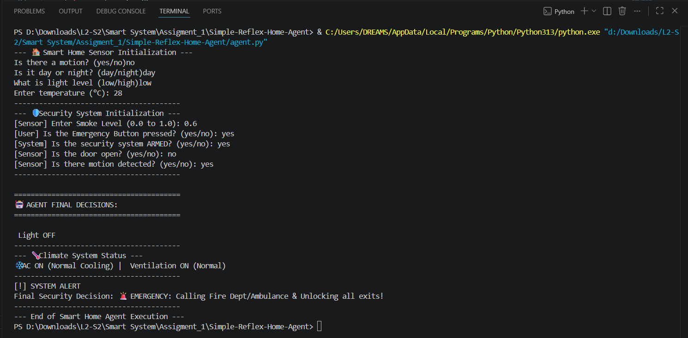

<div align="center">

# 🏠 Simple-Reflex-Home-Agent

<p>
  
  
  
  
  
</p>

<p>
  
  
  
  
</p>

*An intelligent, rule-driven home automation agent built on classical AI principles.*

</div>

---

## 📖 Overview

**Simple-Reflex-Home-Agent** is a Python implementation of a **Simple Reflex Agent** — a foundational architecture in Artificial Intelligence that reacts to real-time sensor inputs using a deterministic set of **condition-action (IF-THEN) rules**, with no reliance on historical state or memory. Designed around the **PEAS framework** (Performance Measure · Environment · Actuators · Sensors), the system orchestrates three independent smart home subsystems — Security & Emergency, Climate Control, and Smart Lighting — and evaluates them in strict priority order to produce a coherent set of actuator decisions. This project demonstrates how classical AI decision models can be applied to practical, real-world automation scenarios entirely within a lightweight, dependency-free Python environment.

---

## 🧠 Architecture & PEAS

```
┌─────────────────────────────────────────────────────────┐
│                    SMART HOME AGENT                     │
│                                                         │
│  SENSORS (Percepts)          ACTUATORS (Actions)        │
│  ─────────────────           ─────────────────          │
│  • Motion (PIR)        ───►  • Lights (ON/OFF/Dim)      │
│  • Time of Day         ───►  • AC / Heater              │
│  • Ambient Light       ───►  • Ventilation Fan          │
│  • Temperature (°C)    ───►  • Security Siren           │
│  • Smoke Level (0–1)   ───►  • Door Lock / Unlock       │
│  • Door Contact        ───►  • Surveillance Cameras     │
│  • Emergency Button    ───►  • Emergency Alert Service  │
│                                                         │
│  ENVIRONMENT: Simulated Smart Home (Fully Observable,   │
│               Deterministic, Single-Agent)              │
│                                                         │
│  PERFORMANCE: Safety · Comfort · Energy Efficiency ·    │
│               Intrusion Prevention                      │
└─────────────────────────────────────────────────────────┘
```

| Layer | Detail |
|---|---|
| **Agent Type** | Simple Reflex Agent |
| **Decision Model** | Hard-coded IF-THEN condition-action rules |
| **World Model** | None — stateless, reacts to current percepts only |
| **Execution Flow** | Emergency → Security → Climate → Lighting |

---

## ✨ Core Modules

### 🛡️ Module 1 — Security & Emergency *(Highest Priority)*
The first and most critical subsystem. Rules are evaluated in strict descending priority to guarantee life-safety responses always execute before any other logic.
- 🚨 **Emergency Protocol:** If the emergency button is pressed OR smoke level exceeds `0.5`, immediately calls Fire Dept./Ambulance and unlocks all exits.
- 🔓 **Intrusion Detection (Armed):** When the system is armed, an open door triggers a siren; motion inside triggers camera activation.
- 🏠 **Welcome Mode (Disarmed):** An open door triggers a friendly welcome sequence and sensor disarm; otherwise, passive monitoring only.

### 🌡️ Module 2 — Climate & Air Quality Control
A dual-track decision engine that independently governs thermal comfort and air quality from a single set of sensor readings.
- ❄️ **Cooling:** AC activates at High Cooling (≥ 30°C) or Normal Cooling (≥ 25°C).
- ✅ **Stable Zone:** No action required between 20°C and 25°C.
- 🔥 **Heating:** Heater engages at Normal (≥ 15°C) or High intensity (< 15°C).
- 💨 **Ventilation:** Four-stage fan control — OFF, Low Monitoring (≥ 0.2), Normal (≥ 0.4), and MAX (≥ 0.7) — driven by smoke concentration.

### 💡 Module 3 — Smart Lighting
An energy-aware lighting controller that weighs three variables — motion, time of day, and ambient light — to make context-sensitive decisions.
- 🌙 **Night + Motion + Low Light:** Lights ON at High Brightness.
- 🌙 **Night + Motion:** Lights ON at standard level.
- 🌙 **Night + No Motion:** Lights OFF.
- ☀️ **Day (any motion state):** Lights OFF — prioritises energy conservation over illumination.

---

## 💻 Getting Started

**Prerequisites:** Python 3.x — no external packages or dependencies required.

```bash
# 1. Clone the repository
git clone https://github.com/Ziad-Bahaa2006/Simple-Reflex-Home-Agent.git

# 2. Navigate into the project directory
cd Simple-Reflex-Home-Agent

# 3. Run the agent
python agent.py
```

The CLI will guide you through entering each sensor value. Once all inputs are collected, the agent evaluates all rules and prints the final decisions for all three subsystems.

```
--- 🏠 Smart Home Sensor Initialization ---
Is there a motion? (yes/no): no
Is it day or night? (day/night): day
What is light level (low/high): low
Enter temperature (°C): 28
...
========================================
🤖 AGENT FINAL DECISIONS:
========================================
 Light OFF
--- 🌡️ Climate System Status ---
❄️ AC ON (Normal Cooling) |  Ventilation ON (Normal)
[!] SYSTEM ALERT
Final Security Decision: 🚨 EMERGENCY: Calling Fire Dept/Ambulance & Unlocking all exits!
--- End of Smart Home Agent Execution ---
```

---

## 📸 Demo




---

## 👥 Team Credits

<div align="center">

| # | Name | Student ID | Role & Module |
|---|---|---|---|
| 1 | **Ziad Bahaa Elsayed** | `2405720` | 👑 Team Lead · Security & Emergency System |
| 2 | **Mohamed Ahmed Elmesarea** | `2405727` | 💡 Smart Lighting Module |
| 3 | **Mohamed Islam Ibrahim** | `2405736` | 🌡️ Climate & Air Quality Module |

*Faculty of Computers and Data Science — Alexandria National University*

</div>

---

<div align="center">

*Built with Python · Grounded in Classical AI · Designed for Real-World Impact*

</div>
